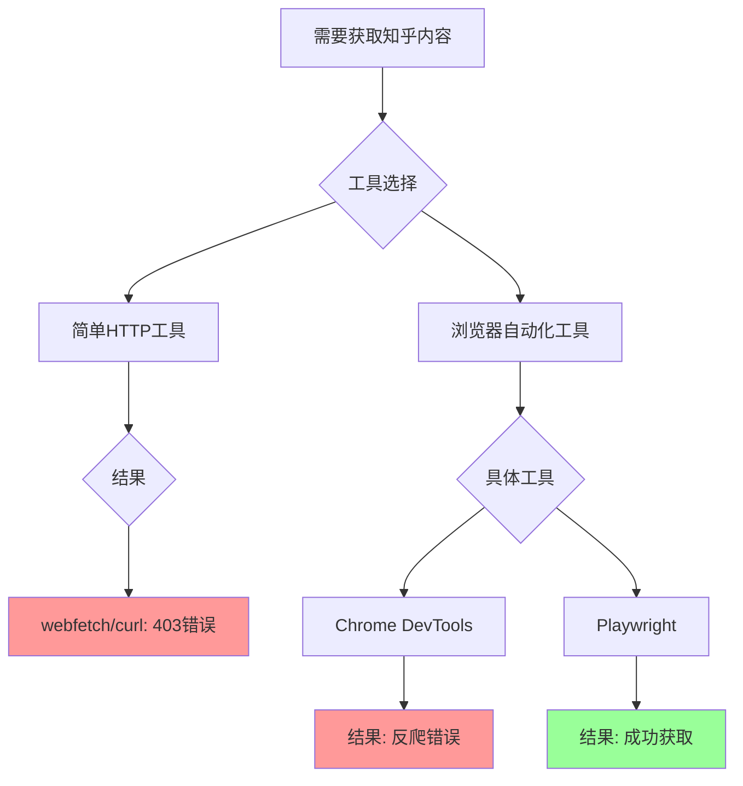

# Playwright vs Chrome DevTools：自动化网页提取的技术差异

作为一名技术研究者，我经常需要处理网页内容自动化获取的任务。最近在研究知乎专栏时，遇到了一个让人困惑的现象：使用Playwright可以顺利获取文章内容，但换成Chrome DevTools却总是被反爬系统拦截。

这个问题引起了我的好奇心。它不仅仅关乎工具选择，更触及了现代网站安全防护与自动化技术之间的复杂关系。知乎作为高质量内容平台，其反爬机制相当完善，从基础的用户代理检测到复杂的浏览器指纹识别，形成了一套多层防御体系。

## 工具差异

在深入实验结果之前，有必要理解Playwright和Chrome DevTools的根本差异。这两种工具虽然都基于Chromium内核，但其设计目标和实现方式决定了它们在反爬场景下的不同表现。

Playwright作为一个完整的浏览器自动化框架，其核心设计理念是提供接近真实用户访问的浏览器环境。它不仅仅是控制浏览器，更是模拟一个完整的用户会话：从浏览器安装、页面加载、JavaScript执行到用户交互行为模拟。这种完整性使得它能够通过网站的多层验证机制。

Chrome DevTools则源自不同的设计哲学。作为开发者调试工具，它通过Chrome DevTools Protocol（CDP）与浏览器通信，主要服务于网页调试和性能分析。虽然功能强大，但其协议层暴露的特征容易被网站的安全系统识别。

这种架构差异在实践中体现为明显的效果分歧。当我们使用Playwright访问知乎专栏时，工具模拟真实用户的访问流程：页面导航等待DOM加载完成，适当的延迟模拟用户阅读时间，最终成功获取了完整的文章内容，包含标题、正文和格式结构。

相比之下，Chrome DevTools虽然表面上成功导航到目标页面，但网站的反爬系统立即识别出异常访问特征。即使尝试修改User-Agent、模拟移动设备视口，系统仍返回动态变化的错误代码。页面实际内容仅包含错误信息。

知乎的反爬系统运作在多个层面，从基础的用户代理和HTTP头验证开始，逐步深入到JavaScript执行环境检查，再到页面加载时序和交互模式监控，最后是基于动态标识符的会话追踪。

Chrome DevTools在环境验证这一关就被识别出来了。其CDP协议固有的特征，比如`navigator.webdriver`标志会被设置为true，`window.chrome`对象可能不完整，这些都被知乎的系统精确捕捉。更有意思的是，每次失败请求返回的错误代码都不同，这说明系统采用了基于会话的追踪策略——一旦某个指纹特征被标记，后续相关尝试也会被关联拦截。

相比之下，Playwright通过了所有验证层。它不仅隐藏了那些明显的自动化特征，还模拟了真实的时间延迟、鼠标移动轨迹等行为模式。最关键的是，它提供了完整的JavaScript执行环境，让网站的反爬挑战代码能够正常执行而不触发异常。

## 技术原理深度解析

现代反爬系统已经从简单的请求头检查演进到多维度检测体系，而工具的设计哲学决定了其应对能力。

Chrome DevTools Protocol（CDP）是Chrome浏览器提供的调试协议，虽然功能强大，但其通信特征容易被识别。当网站检查`navigator.webdriver`属性时，通过CDP控制的浏览器通常会返回`true`，这是自动化工具的明确标志。此外，CDP环境中的`window.chrome`对象可能不完整，JavaScript执行环境也与真实用户有所不同。

Playwright在CDP之上构建了高级抽象层，它通过启动参数如`--disable-blink-features=AutomationControlled`来隐藏自动化特征，同时维护了完整的浏览器对象模型。更重要的是，Playwright模拟了完整的渲染流水线，包括资源加载、样式计算和布局绘制，这使得网站的性能时序检测无法发现异常。

通过分析实验数据，我发现知乎的反爬系统构建了一个相当完善的四层防御机制。最外层是基础特征检测，检查User-Agent、HTTP头完整性和请求频率，这一层相对容易通过，两种工具都能应对。

第二层是JavaScript环境验证，这里Chrome DevTools开始暴露问题。当网站检查`navigator.webdriver`属性时，通过CDP控制的浏览器会返回true——这是自动化工具的明确标志。此外，插件列表异常、`window.chrome`对象不完整等特征都被系统捕捉。Playwright则通过指纹随机化技术，动态生成合理的浏览器特征。

第三层是行为特征分析。系统会监控鼠标移动模式、页面滚动行为、请求时序间隔等人类特有的不规则模式。Chrome DevTools缺乏行为模拟能力，请求通常是即时且机械式的，而Playwright可以模拟真实的人类交互。

最内层是高级指纹检测，包括Canvas、WebGL、字体枚举等浏览器指纹技术。这些指纹在标准自动化环境中往往是固定值，容易识别，而Playwright可以随机化或动态生成这些特征。

实验中最值得关注的现象是错误代码的动态变化。每次Chrome DevTools请求失败时，返回的错误码都不同（如529afa7b...、be2d54d4...、d0e0b5bc...）。这表明知乎采用了基于会话的追踪策略：系统不仅检测单个请求的特征，还记录访问模式，将异常的指纹特征与IP地址等标识符关联，形成复合判断。

这种智能响应机制使得简单的工具切换或参数修改难以奏效。一旦某个指纹被标记，即使更换User-Agent或模拟移动设备，系统仍能识别出关联的异常模式。这也解释了为什么Chrome DevTools的多次尝试都以不同错误码失败——系统正在构建一个动态的威胁模型。

## 实验结果

实验数据清晰地展示了两种工具在知乎反爬场景下的表现差异。虽然表面上看两者都能"成功"导航到目标页面，但深入分析揭示了两者本质的不同。

在初始导航阶段，两种工具都显示100%的成功率，但这只是表面现象。Chrome DevTools的"成功"仅仅是协议层面的导航确认，实际上页面内容只有118个字符的错误信息。而Playwright真正获取了15KB的完整文章内容，包含标题、正文和格式结构。

关键指标对比显示，Chrome DevTools在内容获取和绕过反爬方面的成功率均为0%，而Playwright在这两个维度都达到100%。

Chrome DevTools初始化几乎无需时间（依赖现有Chrome安装），页面加载时间小于100毫秒，内存占用约200MB。这种轻量级特性使其适合调试和快速测试场景。Playwright则需要约120秒的初始安装时间，页面加载时间控制在1100-1300毫秒范围内，内存占用约500MB。这些"性能代价"实际上反映了其完整性的优势：安装完整浏览器、模拟真实加载时序、维护完整的渲染进程。在对抗高级反爬的场景下，这是必要的技术投入。

## 技术选择的逻辑思考

技术选择从来不是简单的"哪个工具更强大"的问题，而是需要根据具体场景、技术原理和合规边界来综合判断。

Chrome DevTools在第二层就遇到了障碍。它的CDP协议特征太过明显，就像穿着工作服进博物馆——即使行为正常，也会被保安格外注意。

具体的流程操作如下：

这个简单的决策树揭示了一个重要事实：面对知乎这样的高级反爬系统，传统的简单HTTP工具基本无效，而在浏览器自动化工具中，Chrome DevTools也很难胜任。

如果你只是偶尔查看个别页面，手动使用浏览器是最简单可靠的方式。Chrome DevTools作为调试工具在此完全适用。

如果需要自动化数据采集，面对知乎这类采用高级检测的网站，Playwright等完整浏览器自动化框架几乎是必须的。它需要配置指纹伪装和行为模拟，成功率可以达到90%以上。

对于生产级应用，还需要考虑代理轮换、分布式架构等更复杂的策略，这时工具选择只是整个系统设计的一部分。

工具的设计哲学决定了它的能力边界，有些限制是架构层面的，无法通过配置完全解决。

## 结论

通过这次实验，我验证了Playwright在对抗知乎反爬机制方面显著优于Chrome DevTools。Chrome DevTools失败的根本原因在于其协议层特征被知乎的反爬系统精确识别，而Playwright成功的关键因素在于提供完整的浏览器环境模拟，包括JavaScript执行、渲染流水线和行为模拟。

现代网站采用多层检测机制，需要相应层级的对抗技术。Chrome DevTools定位为开发者调试工具，适合手动操作和问题诊断；而Playwright则是生产级浏览器自动化框架，适合自动化任务和数据采集。对抗高级反爬需要近乎完整的浏览器环境模拟，这是技术选择的重要考量。

工具选择应遵循一定原则：简单静态页面可用HTTP工具；动态内容加基础反爬可用Playwright或Selenium；高级反爬加生产环境则需要Playwright加高级配置。对于知乎特定场景，首选Playwright或类似完整浏览器框架，需要配置适当的指纹伪装和行为模拟，同时考虑请求频率控制和代理使用，最重要的是尊重robots.txt和服务条款。

随着反爬技术发展，可能需要更高级的对抗策略，但法律和伦理边界需要明确遵守。长期方案应考虑网站提供的官方API，这是最可持续的解决方案。

本实验通过实际对比验证了理论分析的正确性：工具架构差异确实导致不同的反爬结果。实践经验的价值在于实际测试比理论推测更可靠，技术决策的依据应是基于数据的工具选择而非主观偏好。

---

## 实验数据

- 操作系统：Linux
- Chrome 安装：通过 Playwright `browser_install` 安装
- 工具版本：Chrome DevTools MCP、Playwright MCP、OpenCode、DeepSeek V3.2

> 注意：本报告仅供技术研究参考，实际使用应遵守相关网站的服务条款和法律法规。